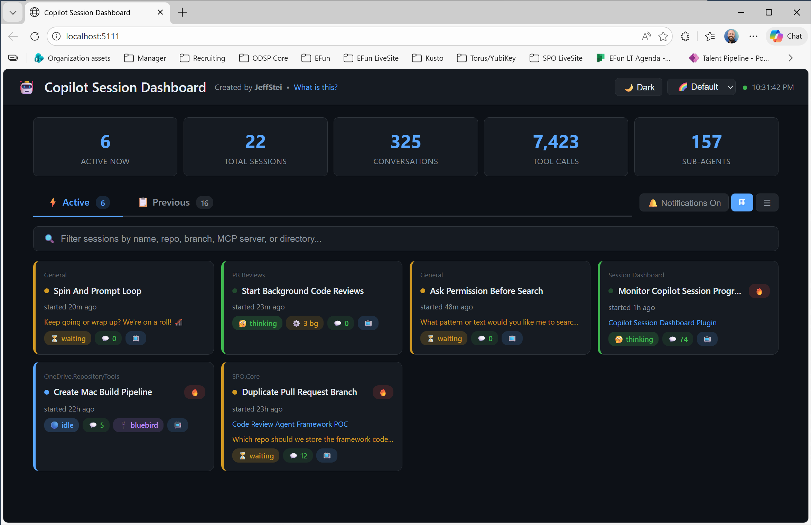

# Copilot Session Dashboard
[](https://github.com/JeffSteinbok/ghcpCliSessionDashboard)
[](https://github.com/JeffSteinbok/ghcpCliSessionDashboard/releases)

[](https://github.com/JeffSteinbok/ghcpCliSessionDashboard/actions/workflows/ci.yml)
[](https://github.com/JeffSteinbok/ghcpCliSessionDashboard/actions/workflows/release.yml)

[](https://github.com/JeffSteinbok/ghcpCliSessionDashboard/actions/workflows/publish-pypi.yml)
[](https://pypi.org/project/ghcp-cli-session-dashboard/)

A local web dashboard that monitors all your GitHub Copilot CLI sessions in real-time.
Designed for power users running multiple Copilot sessions simultaneously.



## Installation

### Option 1: From PyPI

```bash
pip install ghcp-cli-session-dashboard
```

### Option 2: From Source

```bash
# Clone the repo
git clone https://github.com/JeffSteinbok/ghcpCliSessionDashboard.git
cd ghcpCliSessionDashboard

# Install prerequisites
python -m src.session_dashboard install

# Start the dashboard
python -m src.session_dashboard start
```

## Usage

```bash
# Install prerequisites (one-time)
session-dashboard install

# Start the dashboard
session-dashboard start

# Start in background
session-dashboard start --background

# Check status
session-dashboard status

# Stop
session-dashboard stop
```

Open **http://localhost:5111** in your browser.

## Features

### Session States
- **Working / Thinking** (green) — session is actively running tools or reasoning
- **Waiting** (yellow) — session needs your input (`ask_user` or `ask_permission` pending)
- **Idle** (blue) — session is done and ready for your next task

### Desktop Notifications
Click the 🔕 button in the header to enable browser notifications. You'll get an alert whenever a session transitions from working to waiting or idle, so you can stay on top of sessions that need attention without watching the dashboard.

### Views
- **Tile view** (default) — compact card grid to see all sessions at a glance
- **List view** — detailed expandable rows with full session info
- Toggle between views with the buttons next to the Active/Previous tabs

### Session Monitoring
- **Active vs Previous** — sessions with a running `copilot` process appear in the Active tab
- **Waiting context** — when a session is waiting, shows *what* it's asking (e.g. the `ask_user` question and choices)
- **Background tasks** — shows count of running subagents per session
- **YOLO mode indicator** — shows 🔥 YOLO badge for sessions running with `--yolo`
- **MCP servers** — displays connected MCP servers for both active and past sessions
- **Project grouping** — sessions are auto-categorized by repo, working directory, or content analysis

### Actions
- **Focus window** — click 📺 on an active session to bring its terminal window to the foreground
- **Restart commands** — each session has a copy-pasteable `copilot --resume <id>` command (includes `--yolo` only if the session was running with it)
- **Session details** — click any session to see checkpoints, recent tool output, references, and conversation history

### Appearance
- **Light/Dark mode** toggle
- **Color palettes** — Default and Pink themes
- **Auto-refresh** — active sessions poll every 5s, full session list every 30s; expanded sections and collapsed groups persist across refreshes

## Prerequisites

| Package | Purpose |
|---------|---------|
| `flask` | Web server |
| `pywin32` | Window focus and process detection (Windows-only, optional) |

Run `session-dashboard install` to install dependencies.

## Architecture

| Module | Role |
|--------|------|
| `src/session_dashboard.py` | CLI entry point with `install`, `start`, `stop`, `status` subcommands |
| `src/dashboard_app.py` | Flask app with REST API and embedded HTML/JS/CSS single-page dashboard |
| `src/process_tracker.py` | Detects running copilot processes, reads `events.jsonl` for session state, extracts MCP servers, and uses Win32 APIs for window focus |

## Data Sources

| Source | What it provides |
|--------|-----------------|
| `~/.copilot/session-store.db` | Session metadata, turns, checkpoints, files, refs (read-only SQLite) |
| `~/.copilot/session-state/<id>/events.jsonl` | Live session state, MCP config, recent tool output |
| Running `copilot` processes | Active session detection, `--yolo` flag, MCP config file paths |

## API Endpoints

| Endpoint | Method | Description |
|----------|--------|-------------|
| `/` | GET | Dashboard UI |
| `/api/sessions` | GET | All sessions with metadata, groups, restart commands |
| `/api/session/<id>` | GET | Session detail (checkpoints, refs, recent output, turns) |
| `/api/processes` | GET | Currently running sessions with state, yolo, MCP |
| `/api/focus/<id>` | POST | Bring session's terminal window to foreground |

## License

MIT — see [LICENSE](LICENSE) for details.
